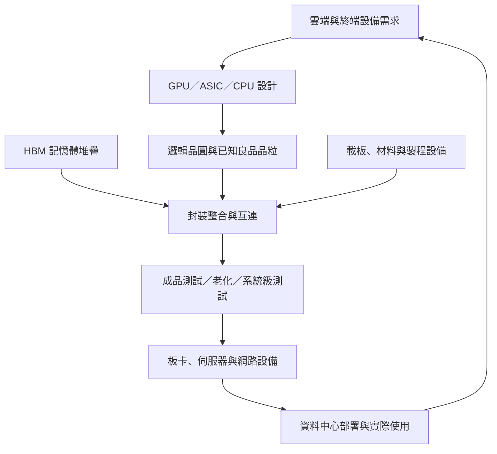

# Semiconductor Packaging｜半導體封裝產業 Buy-side Research

研究日：2026-09-21｜展望期間：2027–2029｜資料截止：2026-09-21 已公開資訊。

本報告涵蓋傳統及先進封裝，以全球產業結構連結台灣上市櫃供應鏈；不提供短期買賣建議。金額除特別註明外，TAM 以美元十億（US$bn），台灣財務數據以新台幣百萬元（NT$m）呈現。資料期間、公司會計年度與曆年分開標示。

標記規則：Fact＝可核對的已發生事實；Estimate＝研究機構估計、公司展望或模型結果；Inference＝證據支持的推論；Assumption＝情境條件。公司公布某項計畫是 Fact，該計畫未來如期實現仍是 Estimate。來源代碼連至文末清單。

## 1｜Industry Definition & System Architecture

### 1.1 研究邊界與付費關係

半導體封裝把已製造的裸晶變成可連接、供電、散熱、保護及測試的元件；先進封裝進一步把多個邏輯晶粒、記憶體及部分光電元件整合為可運作的系統。投資上的計價單位通常是封裝件、晶圓加工步驟或服務組合，不能與 GPU 售價混用。[S01][S02]

| 範圍 | 納入內容 | 經濟邊界 |
|---|---|---|
| 核心：傳統封裝 | Wire bonding、QFN、QFP、部分 BGA、功率封裝 | 收入主要取決於出貨量、封裝型態、材料及稼動率 |
| 核心：先進封裝 | Flip chip、WLCSP、fan-out、2.5D、3D、SiP | 互連密度、面積、整合難度、良率及認證形成差異 |
| 密切相連但單列 | 晶圓測試、成品測試、burn-in、SLT | 測試工時、平行測試數及設備報酬率不同；不是封裝組裝收入 |
| 上游投入，單列 TAM | 載板、導線架、樹脂、薄膜、設備、測試介面 | 是封裝廠成本或資本支出，不能再次加到封裝產值 |
| 邊界外 | 邏輯晶圓製造、HBM 全顆售價、PCB 主板、整機、機房 | 作為需求或瓶頸觀察，不全部計入封裝 TAM |

直接付費者是 fabless、IDM、晶圓代工廠或承接 turnkey 訂單的整合者。終端資金來自雲端業者、企業 IT、手機／PC 使用者、汽車及工業客戶。終端客戶願意付費的理由，是在系統功耗、機櫃空間及總成本限制下，取得更多可用運算與記憶體頻寬。

需求具有「隨新晶片生產重複發生」的特性，卻不是 SaaS 訂閱：同一顆已出貨晶片不會每年再付一次封裝費。NRE／設計與認證收入偏一次性；量產封裝按產量持續；設備銷售偏擴產週期，維護與耗材較持續。

### 1.2 系統架構與兩條資金鏈

Inference：下游採購鏈是「雲端預算 → 晶片與系統採購 → 封裝服務」；供給投資鏈是「封裝廠 CapEx → 設備交付驗收 → 客戶認證 → 量產收入」。兩條鏈有時間差，設備商營收創高可能先於封裝廠 FCF 改善，也可能先於過剩產能出現。

手機路徑則是「手機銷量 × 每機晶片數 × SiP／WLP／flip-chip 採用率」。功率元件路徑是「車輛或工業設備數 × 功率模組配置 × 封裝內容」。不能用 AI 加速器成長率代替這兩條需求曲線。

## 2｜Value Chain & Product Deep Dive

### 2.1 Value Chain

| Segment | Product／Function | Customers | Suppliers／代表角色 | Value Add | Margin Characteristic |
|---|---|---|---|---|---|
| 材料 | 絕緣膜、封裝膠、底填膠、銅／金線；隔離、黏著與應力控制 | 載板及封裝廠 | Ajinomoto、封裝樹脂與金屬材料廠 | 低缺陷、低 CTE、介電與可靠度配方 | 認證配方較有黏著性；金屬轉嫁不等於毛利增加 |
| 互連零件 | ABF／BT 載板、導線架；訊號與電力扇出 | OSAT、IDM、整合封裝平台 | 載板／導線架廠 | 細線路、大面積、多層及翹曲控制 | 高階與一般品供需不同；折舊敏感 |
| 晶圓級中介層 | 矽 interposer、RDL、局部矽橋、TSV | 封裝平台、晶片設計者 | Foundry、OSAT、IDM | 高密度 die-to-die／HBM 互連 | 依製程、良率及是否可替代分化 |
| 封裝組裝 | 接合、molding、underfill、切割、散熱結構整合 | Fabless、IDM／foundry | OSAT、foundry、IDM | 良品交付、可追溯性、共同設計 | 固定成本高；良率與利用率決定利潤 |
| 測試 | KGD、CP、FT、burn-in、SLT | 晶片供應商及 turnkey 廠 | 測試服務與介面廠 | 避免昂貴組件組裝後報廢 | 工時、並測效率、機台價格共同影響報酬 |
| 模組／系統 | 板卡、OAM、伺服器、交換器 | 雲端／企業 | ODM、OEM、系統廠 | 系統驗證及交付 | 不應套用封裝廠毛利率 |
| 終端使用 | 模型訓練、推論、通訊、消費及工業功能 | 企業／消費者 | CSP、設備品牌商 | 每瓦有效運算、延遲及 TCO | 應看實際利用率與變現能力 |

材料、封裝結構及測試功能依官方產品資料整理；毛利特徵為 Inference，並非各產品已披露毛利率。[S01][S03][S04][S05][S31][S32]

### 2.2 重要產品與規格

| 技術／產品 | 實際功能與位置 | 決定價值的規格 | 高階產品為何較昂貴 | 升級與替代方向 |
|---|---|---|---|---|
| Wire bond／QFN | 晶粒接至導線架，常見類比、電源、控制 IC | 線距、腳數、散熱、濕氣敏感性、車規可靠度 | 銅夾、厚銅與車規製程增加成本／驗證，不等於 AI 溢價 | 存續於成本及可靠度優先市場；部分用途被 flip chip／panel 封裝取代 |
| Flip-chip BGA | 晶粒以凸塊面接載板，縮短連線 | Bump pitch、I/O、載板面積／層數、翹曲 | 更密集布線、較長製程、較低初期良率 | 多晶粒與更大載板；不是所有 FC-BGA 都是 CoWoS |
| Fan-in WLCSP | 在原晶粒面積內以 RDL 重分布接點 | I/O 上限、晶粒大小、RDL、板級可靠度 | 輕薄且省材料，但大晶粒板級應力增加 | 受面積與 I/O 限制，部分用途轉向 fan-out |
| Fan-out／FOCoS | 重組晶粒後在模封／介電層形成 RDL；FOCoS 再接載板 | L/S、層數、die shift、翹曲、封裝尺寸 | 額外 RDL 與貼合／曝光／檢測需求 | Wafer／panel 是製造格式；bridge 是互連架構，兩者可結合 |
| CoWoS-S | 大面積矽中介層連接邏輯與 HBM | TSV、布線密度、尺寸、供電完整性 | 矽加工、面積與整體良率成本 | 大尺寸可改採 RDL／局部矽橋；不是所有用途消失 |
| CoWoS-R／L | R 為 RDL interposer；L 加入局部矽互連及嵌入元件 | RDL 精度、局部矽橋接合、背正面互連、翹曲 | 將高密度互連集中在需要區域，仍有整合難度 | 更大面積及更多晶粒／HBM；矽用量與封裝價值可能不同方向 |
| SoIC／hybrid bonding | 晶粒垂直互連，可再放進 CoWoS | 接合間距、對準、表面潔淨／平坦度、熱管理 | 高密度互連與製程控制增加設備和良率要求 | 與 2.5D 互補；不能視為單一路線替換 |
| HBM 堆疊 | 多層 DRAM 與基底晶粒形成高頻寬記憶體 | 介面寬度、資料率、堆疊高度、熱／良率 | 堆疊、TSV、接合及測試增加價值 | HBM3E → HBM4／更高堆疊；HBM 整顆 ASP 包含記憶體製造價值 |
| 高功率測試 | 晶粒及成品驗證、熱壓力篩選 | 接點電流、功率、溫控、測試秒數、parallelism | 昂貴設備及客製介面；可降低昂貴封裝報廢 | 測試強度上升；DFT 與更高並測效率可抵銷工時 |

上表是功能模型，不是產品售價表。各公司產品 ASP、同條件良率與封裝別毛利率多未公開，**目前沒有足夠公開資料支持精確的跨廠 ASP／良率排名**。[S01][S02][S04][S05][S06]

### 2.3 三個可核對的規格錨點

- Fact：台積電 CoWoS-R 公開最小線寬／線距為 2／2 µm；CoWoS-L 結合 RDL 與局部矽互連。[S01]
- Fact：ASE 公布 310 × 310 mm panel 平台，對應 FOCoS／FOCoS-Bridge 的 L/S 分別為 2／2 µm、8／8 µm；預計 2027H1 生產是公司展望。[S07]
- Fact：南電公開路線包含 2027H1 L/S 6／7 µm、bump pitch 80 µm；欣興產品頁列 L/S 8／8 µm、最大封裝尺寸 110 × 110 mm。前者是路線目標、後者是公開產品能力，**不能據此直接判定量產良率或誰已全面領先**。[S08][S09]

Inference：高階封裝的價值增加可拆成「面積 × 互連層數 × 製程複雜度 × 良品交付能力」。若材料消耗上升卻無法轉嫁、返工增加，ASP 上升可能伴隨毛利下降。大封裝的報價高，也不能直接推出每平方毫米獲利高。

## 3｜Market Size & Demand Drivers

### 3.1 TAM 必須保留來源、年份與口徑

以下均為 Estimate，非政府統計普查值。不同列有包含／交集關係，不可相加。

| Segment／來源版本 | Current／基準 TAM | Forecast TAM | CAGR | 主要驅動／限制 |
|---|---:|---:|---:|---|
| 先進封裝：Yole 2026，公開轉述 | 2025：55 | 2031：>120；另一轉述標題 122 | 55→120 約 13.9%；→122 約 14.2%，本報告計算 | AI、HBM、整合；未取得付費原始表，122 不視為單一精確共識 |
| 先進封裝：Mordor 現行公開頁 | 2025：51.62；2026E：57.46 | 2031：90.11 | 2026–31：9.42% | 異質整合；方法及定義不同 |
| 先進封裝：Grand View 現行公開頁 | 2025：41.7；2026E：43.9 | 2033：66.0 | 2026–33：6.0% | 所含類型／應用與其他來源不可直接對比 |
| 先進封裝：Yole 2025，歷史版本 | 2024：46.1 | 2030：79.4 | 2024–30：約 9.5% | 保留預估變化紀錄，不當作最新版 |
| 高階效能封裝：Yole／SEMI 2025 簡報 | 2024：8.0 | 2030：28.5 | 原簡報約 23% | 含 2.5D／3D、記憶體接合等技術分類，非全部 HBM 售價 |
| Panel-level packaging：Yole 2025 | 2024：約 0.16 | 2030：>0.60 | 來源列約 27% | 起點、終點為約數；不可據此精準回推各年 |
| 組裝與封裝設備：SEMI 2026/7 | 2026E：6.7 | 2028E：8.6 | 2026–28：約 13.3%，計算值 | 擴產與新製程；是 CapEx 市場 |
| 測試設備：SEMI 2026/7 | 2026E：15.3 | 2028E：20.8 | 2026–28：約 16.6%，計算值 | 測試複雜度；與封裝設備分開 |
| 傳統封裝服務／全封裝 | 未取得同口徑最新公開完整數據 | 不填入推測值 | 不估 | 不以 OSAT 合併營收扣除先進封裝 TAM 計算 |

來源：[S10]–[S16]。Yole 2026 原始產品頁無法取得全文，55 與 >120 使用 2026/7 公開轉述並降級；Mordor／Grand View 為研究機構自有頁。這些差異不是統計信賴區間，不能取中間值就稱為正確 TAM。

### 3.2 投資模型採用何種數字？

Inference：最新版公開估計反映市場規模及成長路徑上修的可能，但可投資結論應由供應商實際收入驗證。本報告不使用單一全球 TAM 乘上市占率生成公司營收。

Assumption／Estimate：若僅將 Yole 2026 轉述的 55→122 均勻插值，2026 約為 62.81 US$bn。這只是計算示例，不是 Yole 公布的 2026 預測。本報告將其與 43.9／57.46 分開，不聲稱已測得 2026 全年市場規模。

### 3.3 需求公式

| 子市場 | 可用需求公式 | 成長來源 | 必須扣除／調整 |
|---|---|---|---|
| AI 2.5D／3D 封裝 | 加速器封裝出貨件數 × 每件封裝服務收入 | Units、面積／晶粒數、製程內容、Mix | 不能把每機 GPU 數、HBM 數及 GPU 售價重複乘入 |
| 加工產能負荷 | 出貨件數 × 每件有效加工面積 × 製程次數 ÷ 良率 | 面積及層數增加可能快於件數 | 大小封裝、CoW／WoS 工序不可混成同一 wafers/month |
| ABF 載板 | 封裝件數 × 每件載板面積 × 層數／難度因子 × 單位報價 | Content、Mix | 層數因子是分析代理量，不是實際廠商計價公式 |
| 傳統封裝 | 各終端出貨 × 每機需封裝元件數 × 各封裝滲透率 × ASP | Units、產品組合 | 裸晶整合會減少封裝件數；材料轉嫁會拉高收入 |
| 測試服務 | 待測件數 × 測試秒數 × insertions ÷ 並測數 × 每機秒收入 | Complexity、Content | 重測率下降、DFT、並測效率提升 |
| 設備 | 新增／替換機台數 × 機台 ASP + 服務耗材 | Capacity、Technology | 訂單、出貨、驗收與收入認列時點不同 |

上述為本報告 Inference／建模框架。測試 insertions 指實際測試階段，不能假定所有晶片固定有四次。

示例（Assumption）：AI 件數 +25%、每件加工內容 +10%、同規格報價持平，相關收入為 1.25 × 1.10 − 1＝37.5%；若供應商該業務只占原收入 25%，其餘業務持平，公司收入僅約 +9.4%。因此產業 TAM +20% 不代表每家供應商 +20%。

## 4｜End Demand & Customer Economics

### 4.1 真正的需求資料

| Customer／終端 | Demand Driver | 最近可核對趨勢 | Supply Chain Impact |
|---|---|---|---|
| Microsoft | Azure、AI 服務與 GPU 部署 | FY26Q4 法說：CY2026 CapEx 約 US$175bn 為展望；與舊 US$190bn 差異涉及 finance lease 改列 operating lease，投資意圖未因此等幅下修 | 先辨識會計分類，不能直接推論砍單 [S17] |
| Alphabet | 雲端、搜尋及 AI 基礎設施 | 2026Q2 購置 PP&E US$44.924bn，Q1 為 35.674bn，QoQ +25.9%；Q2 FCF −5.855bn，TTM 仍 +53.273bn | 投資擴張有現金成本；追蹤回收而非只看預算 [S18] |
| Amazon | AWS 算力；另含物流設施 | 2026Q2 現金 CapEx US$53.1bn，2025Q2 31.4bn，YoY +69.1%；H1 96.3bn | 全公司 CapEx 並非全數 GPU／封裝需求 [S19] |
| Meta | 推薦、廣告模型、生成式 AI | 2026Q2 CapEx 含 finance lease 本金 US$31.08bn；全年 130–145bn 為展望 | 自用算力擴張，但要與廣告回報配對 [S20] |
| NVIDIA：中間採購者 | GPU／網路平台交付 | FY2027Q2（截至 2026/7/26）營收 US$96.2bn，YoY +106%、QoQ +18%；Data Center 89.0bn，YoY +117% | 收入含晶片／系統／網路 Mix，不能當作 GPU 顆數 [S21] |
| 智慧手機 | 換機與終端售價 | IDC 2026Q2 最終統計 276.3m 支、YoY −7.4%；2026 全年 −16.7% 是 8 月預測 | 與 AI 不同週期；WLP／SiP 成長需靠內容或份額 [S22] |
| PC | 商用換機與零組件成本 | IDC 2026Q2 68.2m 台、YoY −4.9%（研究機構統計） | 高階 CPU Mix 不保證總封裝量成長 [S23] |
| 車用／工業 | 電動化、ADAS、電源管理 | Amkor 2026Q2 公司稱 Automotive & Industrial 創該季紀錄；非全球車市普遍復甦的證明 | 可支持特定客戶／產品改善，不能外推全產業 [S24] |

表中實際公司財務為 Fact；IDC 出貨為第三方統計 Estimate；未來 CapEx 是管理層 Estimate。租賃、現金／非現金、曆年／會計年度口徑不同，不直接把四家 CapEx 相加稱為「AI 封裝需求」。

### 4.2 為什麼客戶願意多花錢？

Inference：封裝費用增加若可提高記憶體頻寬、減少資料搬移功耗、改善每瓦 token throughput，並縮短部署等待，可能降低總成本。真正的採購約束是「可售算力 × 利用率 × 單位毛利」對新增資本投入的回報。更大封裝但長期閒置，仍可能是低報酬投資。

HBM、邏輯與封裝必須同時到位，任何一項缺料都可能讓其他零件變成庫存。因此雲端 CapEx 成長與封裝稼動率之間不是即時、固定比例關係。

### 4.3 客戶多花 1 元 CapEx，怎麼分配？

目前沒有足夠公開資料支持所有 CSP 共用的一組固定分配比例。可使用下列分層公式：

`封裝服務收入增量 = 新增 CapEx × IT 設備比例 × 加速器／高階晶片比例 × 晶片採購價格中的封裝服務比例 × 本期交付比例`

Assumption 示範：1 元 × 60% × 50% × 8% × 100%＝0.024 元封裝收入。60%、50%、8% 都是說明公式的假設，不是實測 BOM。若最後一項封裝占比為 4%／12%，結果為 0.012／0.036 元。

這 0.024 元中再支付的載板、材料是中間投入，不能與 0.024 元相加當新增終端市場；設備則由封裝供應商自己的 CapEx 支付。價值鏈分配應算各層增加值或毛利，不是各層營收直接相加。

## 5｜Supply, Capacity & Industry Economics

### 5.1 先定義有效產能

`有效良品產能 = 名目製程產能 × uptime × 製程／產品轉換係數 × 良率 × 客戶認證可用比例`

`可交付系統數 = min（良品邏輯供應、HBM 配套數、合格封裝產能、載板、測試、系統部署能力）`

Inference：第一式是建模分解，實際工廠可能把部分因子納入 OEE，使用時須避免重扣。公布的機台數、廠房面積及年底月產能都不是全年平均良品出貨。

### 5.2 供給證據與分市場判斷

| 市場／產能事件 | 最新證據 | 狀態判斷 | 無法據此推論的事 |
|---|---|---|---|
| 高階 AI 封裝 | 台積電 2026Q2 法說稱封裝產能仍限制客戶成長 [S25] | Tight，Inference，可信度較高 | 未得到同口徑全球 CoWoS 月產能／缺口百分比 |
| 台積電擴產預算 | 2026 CapEx US$60–64bn；10–20% 給先進封裝、測試、光罩及其他 [S25] | 有擴張意願，金額為 Estimate | 不能把 US$6–12.8bn 全部當 CoWoS CapEx |
| ASE panel 新線 | 310mm 平台預定 2027H1 生產 [S07] | 新增供給／技術選擇，仍待量產驗證 | 發布時不代表已滿載或已取得特定 GPU 訂單 |
| ASE 楠梓新設施 | 2026/3 公布投資 NT$17.8bn，預定 2028Q2 完工 [S26] | 中期供給，不是 2026 可用產能 | 完工不等於當季全部認證、滿載 |
| ASE／WUS 合作設施 | 規劃先進封裝，預定 2029/9 完工 [S27] | 展望期後段供給 | 不計入 2027 基準產能 |
| 一般手機／PC 封裝 | 終端出貨轉弱；產品認證與客戶差異大 [S22][S23] | Balanced 至部分 Oversupply，Inference，低至中信心 | 尚無全市場利用率支持「全部過剩」 |
| 高階載板 | 廠商增加層數、尺寸、布線能力 [S08][S09] | 有局部緊張風險；不能定量確認全產業缺口 | 一般 ABF 空餘產能可無成本轉換為 AI 規格 |
| 高功率測試 | 複雜度提高與 CapEx 增加 [S06][S16] | 特定規格偏緊的可能；依客戶驗證 | 設備市場成長率＝所有測試公司收入成長率 |

全球產能、稼動率、lead time、封裝型態良率並無完整公開可比序列。媒體 wafers/month 常混合年末 run rate、CoW／WoS、不同面積及不同廠商；本報告不以未核實的「十幾萬片」建立精確供需缺口。

### 5.3 Demand Growth vs Capacity Growth

應比較相同規格的「需求加工負荷」與「已認證有效產能」，不是只比較 GPU 顆數與廠房面積。例（Assumption）：件數 +25%、每件面積 +20%，需求面積負荷 +50%；同期間名目面積產能 +40%，若良率由 80%→90%，有效產能約 +57.5%。原本看似短缺，可能因良率爬升轉為平衡。

反之，設備到廠但尚未通過認證，名目產能增加也不會立即提高交付。必須同時追蹤出貨、良率、在製品與折舊。

### 5.4 Pricing 與真正瓶頸

| 項目 | 本報告判斷 | 驗證條件 |
|---|---|---|
| AI 大型封裝每件報價 | Mix／Content 上升有支持；同規格 ASP 漲幅未知 | 相同面積、工序與材料的報價比較 |
| 傳統封裝 | 議價取決於稼動率及材料轉嫁，不能假定全面漲價 | 同產品毛利、材料調價條款及利用率 |
| 高階載板／材料 | 認證與良率形成局部價格保護，程度未量化 | 層數／面積調整後價格、成本及交期 |
| 設備 | 新機種 ASP 與新製程驗證價值可能增加 | 同機種訂單、驗收、毛利及應收款 |

Inference：目前證據最強的瓶頸是**客戶認證完成、可穩定交付的大型高密度封裝整合產能**。HBM 配套、載板翹曲、熱管理與高功率測試可成為個別專案的共同瓶頸。瓶頸會移動；缺貨只提供議價機會，客戶長約、垂直整合及降價條款仍決定誰取得租金。

## 6｜Competitive Landscape & Market Share

### 6.1 不同競爭場域不可混用市占

OSAT 是商業模式；advanced packaging 是技術集合。台積電、Intel、Samsung 可能以內部轉撥或整合銷售提供封裝，與 OSAT 營收排名不是同一母體。

特別的資料品質問題：TrendForce 2024 排名列 ASE US$18.54bn、前十大合計 US$41.56bn，ASE 約占 45%。但是日月光 2024 合併收入含 EMS；公司揭露 ATM（部門、沖銷前）為 NT$325.875bn、合併收入 NT$595.410bn。**這個 45% 不能解讀成純封裝服務全球市占**，也不能拿來推算 CoWoS 市占。[S28][S29]

以下數字僅保留原資料口徑；尚未取得同口徑完整 2025／2026 排名，2024 排名不冒充當前市占。

| Company／角色 | Market Share／收入錨點 | Technology | Capacity／Yield／Cost 證據 | Customer／Position |
|---|---|---|---|---|
| TSMC：平台領導者 | 純封裝市占未公開 | CoWoS-S/R/L、SoIC、InFO | 具公開量產與路線；分產品產能、良率及毛利未完整揭露 | 與晶圓製造、設計生態共同最佳化；不是所有代工收入都來自封裝 |
| ASE：大型 OSAT | 2026Q2 ATM NT$126.148bn，含測試／材料 | VIPack、FOCoS、bridge、SiP | 310mm 新平台與擴廠時間可核對；不同專案良率不公開 | 多客戶、多技術；能承接部分分工不表示擁有全部 3D 核心製程 |
| Amkor：大型 OSAT | 2026Q2 US$1.898bn，YoY +26% | Flip chip、SiP、fan-out 等 | 公司毛利可核對；高階品收入、良率與份額不完整 | 計算與車用／工業成長；地域分散有價值 [S24] |
| JCET：中國挑戰者 | 2024 US$5.0bn，YoY +19.3%，第三方排名 | XDFOI 等異質整合 | 不具可比客戶良率資料 | 本土需求、客戶導入；增速不全等同有機份額增加 [S28][S30] |
| Tongfu：客戶集中型 OSAT | 2024 US$3.32bn，YoY +5.6% | 高效能多晶粒封測 | 精確先進封裝產能／單位成本未驗證 | 第三方指出 AMD 曝險；不填客戶占比 [S28] |
| Intel：替代平台 | 對外封裝市占未分拆 | EMIB、EMIB-T、Foveros | 公布局部矽橋／TSV；比較需同尺寸、功耗及良率 | 具架構差異；對外量產客戶數與收入仍需追蹤 [S04] |
| Samsung：垂直整合者 | 純封裝市占未公開 | I-Cube、X-Cube、fan-out | 官方產品存在不等於先進邏輯／HBM 所有平台皆認證 | 邏輯＋記憶體＋封裝整合機會 [S05] |
| PTI：記憶體／面板封裝利基 | 2024 US$2.28bn，YoY +1%，第三方排名 | 記憶體封測、FOPLP | 具相關平台；未核實高階 AI 占比 | 不把一般 DRAM／NAND 封測等同 HBM 份額 [S28][S33] |

### 6.2 Gain Share／Lose Share 的可驗證程度

- Fact／Estimate：2024 排名顯示 JCET 與 HT-Tech 收入增速高於前十大合計；這支持其在該排名收入比重上升，尚不足證明全球同技術有機市占上升。[S28]
- Inference：高階整合可能往可承擔共同設計、良率責任與大規模投資的平台集中；局部製程外包則可能讓 OSAT 同時擴大收入。平台集中與分工擴大可以同時發生。
- Missing Evidence：2026 同口徑份額、外包比例、客戶別合格產能及專案良率。無此資料，不指定「某台廠必定搶走某競爭者訂單」。

### 6.3 具體門檻與切換成本

認證包含晶粒／載板共同設計、熱循環、電源完整性、訊號完整性、封裝可靠度、測試程式與量產良率。換供應商可能需要重做 package design、基板、光罩、測試及系統認證。這提供設計定案後黏著性，但下一代產品仍可重新選擇架構。

規格例：Intel EMIB-T 把 TSV 加入局部矽橋；CoWoS-L 是 RDL 加局部矽互連。兩者都處理大型多晶粒互連，材料及工序分配不同。僅比較「reticle 倍數」不足判定誰領先，還要同時比較可量產時間、HBM 配置、熱設計、每良品成本及客戶資格。[S01][S04]

Inference：供應商在已認證且稀缺產能上有較大議價力；少數大客戶則可透過長約、預付、共同投資及第二來源分攤租金。定價權是雙邊協商結果，不是永久單向。

## 7｜Technology Roadmap & Substitution Risk

### 7.1 不是一條全部取代的路線

| Current Architecture | Next Generation | Future／時間證據 | 價值轉移與風險 |
|---|---|---|---|
| 單晶粒 FC-BGA／SiP | 多晶粒／chiplet＋2.5D | 與 3D 堆疊並存 | 晶圓成本可能下降，封裝互連與測試內容增加；整合後封裝件數可能減少 |
| 大面積矽 interposer | RDL＋局部矽橋 | CoWoS-L／EMIB-T 等擴大 | 全面積矽加工占比可能下降，RDL、接合、載板與翹曲管理變重要 |
| 台積電 5.5× reticle | 更大 CoWoS | 2026 公告：14×／約 10 大晶粒＋20 HBM，規劃 2028；>14× 與 SoW-X 規劃 2029 | 皆為 roadmap；不能當作已出貨量或所有 GPU 標準配置 [S34] |
| Microbump 互連 | 部分 hybrid bonding | SoIC 與 2.5D 配合 | 每 I/O 能耗與密度改善；新增潔淨、平坦度與量測成本，不代表立刻全面取代凸塊 |
| HBM3E | HBM4、更高堆疊 | JEDEC HBM4：2048-bit、8Gb/s 的標準例；Micron 公開產品規格 >11Gb/s、>2.8TB/s | 標準與廠商產品速度不同；不能混算頻寬 [S35][S36] |
| 高密度 HBM 互連 | SPHBM4 有機載板選項 | JEDEC 2026/7 公布 JESD330-4；512 signals、4:1 序列化 | 可能降低部分應用矽中介層依賴；量產客戶、功耗／延遲及採用率仍待證明 [S37] |
| 圓晶圓格式 fan-out | Panel 格式 | ASE 310mm 新線目標 2027H1 | 面積利用率提高；缺陷、翹曲、die shift、曝光與搬運是限制 [S07] |
| 有機 core 載板 | 低 CTE／玻璃 core 方案 | 各家認證階段不同 | 不等於取消 build-up、銅導線或封裝載板；玻璃 core／玻璃 carrier／玻璃 interposer 不同 |
| 可插拔光模組 | CPO／光電整合 | 台積電 COUPE on substrate 計畫 2026 生產 | 增加光電接合／測試；產品公告不等於大規模客戶收入 [S34] |

### 7.2 Unit Value Content 是否一定上升？

Inference：每個封裝的運算晶粒、HBM 數及層數提高，通常增加加工內容；但每單位算力的封裝費用可能下降。Panel、局部矽橋與測試效率提升的目的正是降低單位成本。投資模型要同時追蹤「每件」與「每單位算力」內容，避免把同一筆技術進步重複視為量與價的成長。

Assumption：310 × 310 mm 的幾何面積 96,100 mm²，相較直徑 300 mm 圓片約 70,686 mm² 多 36%。這是幾何計算，**不是良品數多 36%、成本少 36% 或收入多 36%**；需再納入邊緣排版、工序時間、良率與設備成本。

### 7.3 Winners／Losers：條件式判斷

| 潛在 Winners（Inference） | 成立條件 | 潛在 Losers／被稀釋部分（Inference） |
|---|---|---|
| 可量產的大型封裝整合平台 | 高良率、客戶認證與稀缺產能同時存在 | 無法支援新尺寸／功率但大量擴產的舊線 |
| 高階載板、低 CTE 材料、RDL／清洗／量測設備 | 技術被採用，且有可驗證收入與合理投資報酬 | 全面積矽中介層部分工序可能被局部橋接稀釋 |
| 高功率測試與精密介面 | 測試需求成長快於並測／DFT 效率改善 | 只靠測試秒數永久增加的投資敘事 |
| Panel／玻璃製程先通過認證者 | 面積成本優勢轉成合格良品成本優勢 | 舊設備可能需更新；不具新線資格的供應商 |

目前沒有足夠公開資料支持「所有 CPO 都會降低主板 CCL 等級」、「HBM4 一定全面 hybrid bonding」、「FOPLP 即將取代所有 CoWoS」或「玻璃基板將取消 ABF」。本報告不採用這些假設。

## 8｜Industry Cycle & Leading Indicators

### 8.1 至少八季的營運證據

日月光 ATM 部門營收（含部門內口徑，沖銷前）與毛利率是可持續取得的封測代理指標，**不是全球純封裝市場**。資料採公司各期未經查核法說口徑，不混入 EMS。較早比較基期不足者留空；YoY／QoQ 為計算值。[S29][S38]

| 季度 | ATM 營收 NT$m | YoY | QoQ | ATM 毛利率 |
|---|---:|---:|---:|---:|
| 2024Q3 | 85,790 | — | +10.3% | 23.1% |
| 2024Q4 | 88,363 | — | +3.0% | 23.3% |
| 2025Q1 | 86,668 | +17.3% | −1.9% | 22.6% |
| 2025Q2 | 92,565 | +19.0% | +6.8% | 21.9% |
| 2025Q3 | 100,289 | +16.9% | +8.3% | 22.6% |
| 2025Q4 | 109,707 | +24.2% | +9.4% | 26.3% |
| 2026Q1 | 112,434 | +29.7% | +2.5% | 26.0% |
| 2026Q2 | 126,148 | +36.3% | +12.2% | 27.3% |

補充基期為 2024Q1 NT$73,908m、Q2 NT$77,813m。最近月度 ATM：2026/8 NT$51,287m，YoY +53.1%、MoM +7.9%；美元口徑 YoY +41.4%。月報與季報須對齊部門沖銷口徑，不能未調整就以月度加總推估部門毛利。[S39]

交叉檢查：Amkor 2026Q2 收入 US$1.898bn、毛利率 16.8%，前季 14.2%、去年同季 12.0%。兩家均改善支持封測景氣升溫，但 Amkor 2025Q2 營業利益含 US$32m 或有支付利益，比較獲利時應排除一次性。[S24]

Inference：高階 AI 封裝是 Structural Growth 疊加擴產週期；一般封裝不能直接定為全面 Mid Cycle。日月光成長加快與手機／PC 下滑同時存在，是本輪最重要的分歧。匯率、Mix、測試比重及併購都可能影響表面成長率。

### 8.2 Leading Indicators

領先期為 Assumption／工作假說，未做統計回歸驗證，不宣稱每次有效。

| Indicator | Current Direction／截至研究日 | Bull Signal | Bear Signal | 預期領先 earnings |
|---|---|---|---|---|
| CSP 實際 CapEx＋已供電部署 | 投資仍強；會計分類分化 | 設備交付與使用同步增加 | CapEx 成長但部署／現金回報惡化 | 1–4 季 |
| GPU／ASIC 系統收入與庫存 | NVIDIA 收入強；收入不是件數 | 新平台按期交付、庫存匹配 | 在製／存貨先於收入快速增加 | 1–2 季 |
| 封裝客戶認證與交期 | 高階產能仍限制交付；精確交期未知 | 認證轉量產且維持交期 | 擴產後交期大幅縮短、取消拉貨 | 1–3 季 |
| OSAT ATM 三個月平均營收 | 日月光最近年增加速 | 恆定匯率成長與毛利同步 | 營收成長但毛利連降 | 0–1 季 |
| 毛利率／折舊／良率 | ATM 毛利改善，設備投資高 | 增量毛利覆蓋折舊 | 折舊加快但毛利／稼動率下滑 | 0–2 季 |
| 設備訂單、驗收與應收 | SEMI 設備展望增加；個別 B/B 未全數公開 | 訂單轉驗收、收款 | 遞延驗收、應收及存貨堆高 | 1–4 季 |
| 高階 ABF 規格／合格產出 | 路線升級；全球利用率未知 | 高階良率提升且供貨穩定 | 技術轉換慢、一般品價格下降 | 1–3 季 |
| HBM 新世代認證／供給 | HBM4 產品／規格推進 | 多來源通過客戶認證 | 配套缺料拖延整機交付 | 1–3 季 |
| 手機／PC 出貨 | 2026Q2 下滑 | 連續兩季改善且庫存下降 | 記憶體漲價壓縮低價設備需求 | 1–2 季 |
| CFO − 現金 CapEx／淨負債 | ASE H1 擴產壓低 FCF | 量產後現金回收 | 借款、應收、存貨同步升高 | 0–2 季 |

來源：[S16]–[S25][S38][S39]。SEMI 已於 2017 年停止北美月度 Book-to-Bill 公布；不要把過時序列列為目前可更新指標。改看有揭露訂單的設備廠，但不可自行填入未公布的 B/B。[S40]

## 9｜Profit Pool & Earnings Transmission

### 9.1 誰賺最多，必須先選尺度

毛利率最高、毛利總額最大、ROIC 最高與 EPS 增長最快不是同一件事。垂直整合公司未分拆封裝利潤，不能用台積電或 NVIDIA 全公司毛利率，宣稱封裝本身擁有相同利潤率。

| Segment | Revenue Pool | Margin 證據／特性 | ROIC | Pricing Power | Capital Intensity |
|---|---|---|---|---|---|
| 晶圓＋整合封裝平台 | 封裝純收入未完整公開 | 台積電全公司毛利不可當 CoWoS 毛利 | 封裝專屬資本未分拆，無法可靠計算 | 共同設計、良率及產能資格形成議價 | 高 |
| 多元 OSAT | 可取得公司 ATM／封測收入 | ASE ATM 27.3%；Amkor 16.8%，2026Q2，口徑不同 | 應以平均投入資本＋正常化 NOPAT 計算；不提供假精確排名 | 高階強、標準品相對弱，Inference | 高 |
| 特殊材料／配方 | 營收池較封裝小，精確可比值不足 | 客戶認證、配方與成本轉嫁重要 | 可能較高，未取得獨立分部資本驗證 | 若為少數合格來源較強 | 中，依製程 |
| 載板 | 上游市場，不能加總至封裝 TAM | 高階 Mix 可改善毛利，良率／折舊可能抵銷 | 大額擴廠可壓低短期回報 | 高階局部、一般品較弱 | 高 |
| 設備／量測 | SEMI A&P 2026E US$6.7bn | 新機種與售服 Mix；非每台都同毛利 | 較製造端低固定資產不等於低營運資金 | 取決於 process of record 與替代能力 | 相對較低至中 |
| 測試／介面 | 與封裝服務相鄰 | 高工時／高針數帶動收入；並測與良率可抵銷 | 需檢查每台設備／每張介面回收 | 高功率／高頻／密腳規格較有壁壘 | 服務端高；介面製造依技術 |
| 傳統封裝／導線架 | 大量成熟需求 | 成本與稼動率主導；不能給 AI 全面溢價 | 低價擴產可能稀釋 ROIC | 同質化品較弱 | 中至高 |

Fact 數值來自 [S16][S24][S38]；其餘為 Inference。未取得跨廠同口徑分部資產與 NOPAT，因此無法證明某一封裝子環節已具有最高 ROIC。

### 9.2 獲利傳導與現金流

`End Demand → 實際晶片出貨 → 每件互連／測試內容 → 同規格 ASP 與 Mix → 供應商收入 → 稼動率／良率 → 毛利 → 營業利益 → 歸母淨利／稀釋 EPS → CFO → 扣除現金 CapEx 的 FCF`

建模公式：

- `Revenue = Σ（合格交付量 × 公司可認列每件收入）`。
- `Gross profit = Revenue − 材料 − 變動製造成本 − 固定成本 − 折舊 − 報廢／返工`。
- `EPS =（營業利益 + 業外 − 稅 − 非控制權益）÷ 加權平均股數`。
- `FCF = CFO − 現金 PP&E 支出`；併購另列，不能以設備下單額替代現金支出。
- `ROIC = 正常化 NOPAT ÷ 平均投入資本`；需要納入新廠、在建工程及營運資金，不能只用已折舊舊設備資本。

Fact／計算：ASE 2026Q2 CFO 47,014、現金 PP&E 79,849，FCF＝−32,835 NT$m；H1 分別 83,401／123,941，FCF＝−40,540 NT$m。[S38]

Inference：這證明本期成長伴隨現金投入，不能單因 EPS 上升宣稱 FCF 品質改善；也不能因擴產負 FCF 就斷定 thesis 失效。後續需驗證新線收入、回收期與淨負債。

敏感度示例（Assumption／Estimate）：以 ASE 2026Q2 ATM 收入 126,148 NT$m 為固定基底，部門毛利率 +1 個百分點、費用不變、邊際稅率假設 20%、增益全歸母公司、股數 4,386.712m，單季 EPS 增益約 NT$0.23。這是局部敏感度，非 EPS 預測；無法忽略新增折舊、費用與稀釋股數。[S38]

### 9.3 最重要的三個 Thesis 及反證

| Thesis（Inference） | Supporting Evidence | Contradicting Evidence | Missing Evidence |
|---|---|---|---|
| 複雜度增加使高階封裝內容成長快於終端台數 | 大尺寸、HBM4、多晶粒路線；實際 ATM 成長 [S34]–[S39] | 局部矽橋、panel、SPHBM4 可降低部分加工成本 | 每平台實際封裝費、出貨與供應商份額 |
| 認證產能稀缺使整合平台有超額獲利機會 | 台積電產能說明、ASE 毛利改善 [S25][S38] | 大客戶議價、替代平台與擴產；毛利也可能受匯率／Mix 推升 | 同規格 ASP、長約定價與合格良品產能 |
| 高階測試／量測／介面有較高內容增長 | 高功率規格與測試設備展望 [S06][S16] | DFT、並測及良率提升可降低機台時間 | 每顆測試秒數、insertions、價格及設備回收 |

只有在缺口補足後才能把「可能獲得高於產業的 EPS 成長」提升為具體個股正式盈利預測。

## 10｜Taiwan Supply Chain Mapping

### 10.1 分類與證據規則

Direct＝實際承接相關加工／產品需求；Content＝每件使用量或難度增加；Mix＝高價值產品占比提升；Capacity＝已認證稀缺產能；Indirect＝透過客戶投入或相鄰市場傳導。可以重疊，但「有能力」不等於「已獲訂單」。

下表產品能力依官方資料；競爭位置與盈利敏感度為 Inference。未經官方核實之特定 NVIDIA／AMD／TSMC 專案，不列為確定客戶。這是主要投資研究覆蓋，並非所有上市櫃公司的窮盡名單。

| Segment | Taiwan Company | Product／Customer Exposure | Competitive Position／類型 | Industry Driver → Revenue → Margin → EPS |
|---|---|---|---|---|
| Foundry 整合封裝 | 2330 台積電 | CoWoS、SoIC、InFO；HPC／AI 設計客戶 | 整合平台；Direct／Content／Capacity | 多晶粒需求→封裝及晶圓收入→受良率與海外／新製程成本影響→不能把全公司 EPS 當純封裝彈性 [S01][S25] |
| OSAT | 3711 日月光投控 | 封裝、測試、材料；另含 EMS | 多技術／多客戶；Direct／Content／Mix | 高階工序與測試增加→ATM 收入→稼動／Mix 對抗折舊→EPS 受 EMS、業外及股數影響 [S07][S38] |
| 記憶體封測／FOPLP | 6239 力成 | 記憶體封測、panel fan-out；精確 AI 占比未知 | 利基與新平台；Direct／有條件 Mix | 記憶體出貨及新線認證→收入→利用率／爬坡→EPS；不認定為 HBM 直接龍頭 [S33] |
| Bumping／WLP | 6147 頎邦 | RDL、bumping、WLCSP；顯示等既有應用 | 利基；Direct／有條件 Content | 客戶 IC 出貨及 RDL 層數→收入→產品 Mix／利用率→EPS，需證明新增 AI 收入 [S31] |
| 記憶體／DDIC 封測 | 8150 南茂 | 記憶體、顯示驅動與混合訊號封測 | 成熟應用；Direct | 終端／庫存循環→封測量→折舊吸收→EPS；AI 敘事傳導弱於實際記憶體／顯示需求 [S32] |
| 測試服務 | 2449 京元電子 | CP、FT、burn-in、SLT；官方支援 2.5D／3D | 高功率測試；Direct／Content／Capacity（有條件） | 測試量×時間／並測數→收入→設備利用率→EPS；新增機台資本成本須扣除 [S06] |
| ABF／FC-BGA | 3037 欣興 | 載板兼其他 PCB；HPC／AI／server 產品能力 | 技術與量產平台；Content／Mix | 面積、層數增加→高階載板收入→良率／折舊→EPS；非所有 PCB 都直接受惠 [S09] |
| ABF／載板 | 8046 南電 | ABF、PP 載板與 PCB；大型多層規格 | 高規路線；Content／Mix | 高階載板需求→利用率與產品組合→固定成本吸收→EPS；路線目標不能當現有滿載 [S08] |
| ABF／BT 載板 | 3189 景碩 | IC 載板，含不同終端產品 | 技術／客戶組合；Content／Mix | AI、伺服器與消費需求分化→ABF／BT 組合→良率／價格→EPS；BT 不應自動套用 AI 增速 [S41] |
| 導線架 | 6548 長華科 | 銅合金導線架、pre-mold 等；類比／電源等 | 成熟與利基；Direct | 元件出貨→導線架數量→金屬轉嫁、車規 Mix／利用率→EPS；非 CoWoS 核心 [S42] |
| 封裝材料／通路 | 8070 長華\* | 封裝材料及合資布局 | Indirect／Mix | 膠材耗用→銷售／轉投資收益→通路與自製毛利不同→合併、權益法口徑需分開 [S43] |
| 濕製程設備 | 3131 弘塑 | 清洗、去光阻等；官方涵蓋 2.5D／3D／HBM／PLP | 本地製程整合；Direct 對封裝 CapEx | 新增工序及機台→出貨／驗收→新機種／售服 Mix→EPS；下單不等於認列 [S44] |
| 濕製程／暫時接合 | 3583 辛耘 | 自製設備、代理、再生晶圓 | 多業務；Direct／Indirect | 封裝投資→自製設備收入→組合毛利→EPS；不可把整體營收視為 CoWoS [S45] |
| 自動化／點膠／貼合 | 6187 萬潤 | 精密控制、貼合、點膠、光學檢測 | 客製化整合；Direct 對設備需求 | 大尺寸製程／自動化→設備驗收→毛利取決新案成本→EPS，具訂單集中波動 [S46] |
| 量測／測試設備 | 2360 致茂 | IC 測試、TSV／RDL 等 2D／3D 量測；亦有其他測試業務 | 多領域平台；Content／Mix（有條件） | 測試／量測強度→相關產品收入→規模效益→EPS；展會產品非訂單金額 [S47] |
| Probe card | 6223 旺矽 | 探針卡與相關測試平台 | 高針數／電流／精度；Content／Mix | 新晶片與測試規格→探針卡及替換需求→產品良率／利用率→EPS；不把所有收入歸因封裝 [S48] |
| 測試介面 | 6510 精測 | Probe card、PCB、interposer 等整合介面 | 垂直整合能力；Content／Mix | 高頻高密度介面→每卡內容／新案→良率及研發攤提→EPS；須核對量產占比 [S49] |

長華\* 的星號沿用市場名稱，與長華科不是同一法人，不能將集團營收重複加總。

### 10.2 公司曝險如何變成可計算模型？

`公司總營收成長 ≈ Σ（基期業務占比 × 該業務收入成長）`

`相關業務成長 =（市場交付量變化 × 每件內容變化 × 實際價格變化 × 公司份額變化）−1`

對「先進封裝占比未揭露」的設備、材料、載板公司，不填入猜測占比，改用三個可驗證代理：相關新產品收入／訂單、分部毛利與實際現金回收。若只有新聞點名，尚不足建立量化 EPS 模型。

| 高敏感度模式 | 較有可能超越產業平均的條件 | 主要破壞因素 |
|---|---|---|
| 高階 OSAT／測試 | Content 增加＋利用率上升＋費用成長較慢 | 測試效率提高、新線折舊／研發過高 |
| 高階載板 | 面積／層數＋良率改善＋高階缺口 | 量增但報廢、翹曲與折舊抵銷毛利 |
| 設備／量測 | 新製程滲透＋既有平台份額提升 | 訂單提前拉貨、驗收遞延或下一輪 CapEx 下降 |
| 精密測試介面 | 每卡內容＋新平台數＋替換需求 | 客戶集中、競爭導入、並測架構改變 |

## 11｜Risks, Scenarios & Market Expectations

### 11.1 Probability × Impact

以下為 Assumption／研究優先分數：P、I 各 1–5，為序位評分，不是精準機率或預期損失。觀察窗口為未來 2–3 年。

| 排序／風險 | P | I | 分數 | 可觀察反證／受影響路徑 |
|---|---:|---:|---:|---|
| 1 AI 投資回收慢，CSP 降低新增採購 | 3 | 5 | 15 | 兩家以上 CSP 同口徑實體投資下修且部署放緩→量／稼動下降 |
| 2 擴產超過合格需求 | 3 | 5 | 15 | 認證產能增長快於需求、交期縮短及利用率連降→ASP／毛利下降 |
| 3 客戶集中／垂直整合 | 3 | 4 | 12 | 自製或轉單、委外比例下降→供應商份額降低 |
| 4 先進製程良率／封裝尺寸爬坡不順 | 3 | 4 | 12 | 認證延期、報廢與 WIP 增加→交付、毛利及 FCF 受損 |
| 5 股價已反映高成長／倍數收縮 | 3 | 4 | 12 | 盈利成長低於 reverse valuation 門檻；即使營收仍成長也可能去評價 |
| 6 傳統終端弱、材料漲價無法轉嫁 | 4 | 3 | 12 | 手機／PC 降量、金屬成本升、同規格毛利下降 |
| 7 架構替代降低既有內容 | 3 | 4 | 12 | bridge／panel／SPHBM4 取得量產，原製程占比下滑 |
| 8 HBM／載板／電力配套瓶頸 | 3 | 4 | 12 | 封裝有產能但缺配套，交付遞延及庫存增加 |
| 9 CapEx 前置、驗收／庫存修正 | 3 | 4 | 12 | 設備訂單減、應收及存貨升、封裝廠 FCF 持續負值 |
| 10 地緣／出口政策／營運中斷 | 2 | 5 | 10 | 特定出口許可限制或產區停工→客戶可服務市場／供給下降 |
| 11 新進入者與中國本土化競爭 | 3 | 3 | 9 | 新供應商通過資格並以價格換量→份額／ASP 受壓 |
| 12 匯率及資金成本 | 3 | 3 | 9 | 新台幣、避險及借款成本變化→收入換算／業外／EPS 變動 |

出口政策情境是風險假設，未在此報告就個別產品提供法規適用判定。

### 11.2 Devil's Advocate

1. 市場可能把「封裝不可或缺」推成「所有封裝公司均有定價權」。反證是傳統終端弱、委外比例與供應商能力不一。
2. TAM 最脆弱的假設是長期 Units、每件收入及新技術採用率同時高成長。Panel／bridge 降本可能使出貨成長快於美元 TAM。
3. CapEx 不等於封裝預算，可能被機房、供電及昂貴記憶體吸收；會計分類改變也會干擾趨勢。
4. 供給最容易看錯的是良率、認證及不同工序可互換性。市場既可能低估名目擴產轉量產的時間，也可能低估良率改善帶來的有效產能。
5. Roadmap 最易延後的不是單項 demo，而是整個大尺寸封裝＋HBM＋載板＋散熱＋測試系統同時達標。
6. 最脆弱的台股 earnings thesis，是把所有收入當成先進封裝、只看高階新品而不扣舊業務衰退，或把設備訂單永久年化。
7. 價格上漲只證明市場重新定價，不能反向證明獨占或新訂單。以股價走勢驗證技術敘事，屬 Price-action Bias。

### 11.3 Bear／Base／Bull：可重算的產業敏感度

本模型為 **Assumption＋Estimate**，用於比較 2027 相對於一個標準化 2026 營運基底的敏感度，不是任何公司的管理層指引、完整產業預測或 EPS 共識。

基底：營收＝100，其中 AI／高階相關收入＝25、成熟業務＝75；毛利率 25%、Opex＝12，營業利益＝13；無業外、稅率 20%、股數固定，基期 EPS 指數＝100。25% 曝險僅為假設，非 ASE LEAP 或任何台廠實際占比。有效產能以已調整良率與產品 Mix 的「可交付件數」計，基期利用率假設 90%。

| 驅動／結果 | Bear | Base | Bull |
|---|---:|---:|---:|
| 高階封裝需求件數 YoY | −5% | +25% | +45% |
| 高階有效產能 YoY | +15% | +30% | +40% |
| 推導高階利用率 | 74.3% | 86.5% | 93.2% |
| 每件加工內容 | +5% | +10% | +15% |
| 高階同規格 ASP | −7% | 0% | +3% |
| 高階收入成長（乘積） | −7.2% | +37.5% | +71.8% |
| 成熟需求件數／ASP | −5%／−4% | 0%／−1% | +5%／0% |
| 總收入指數 | 91.59 | 108.63 | 121.69 |
| 總收入 YoY | −8.4% | +8.6% | +21.7% |
| 毛利率假設 | 20% | 26% | 30% |
| Opex 指數金額 | 12.0 | 12.7 | 13.5 |
| 營業利益 | 6.32 | 15.54 | 23.01 |
| EPS 指數 | 48.6 | 119.6 | 177.0 |
| EPS YoY | −51.4% | +19.6% | +77.0% |
| 估值壓力測試 P/E，非合理價認定 | 15× | 20× | 25× |
| 若基期 20×，價格指數＝EPS 指數×P/E÷20 | 36.5 | 119.6 | 221.2 |

公式：`高階收入倍率 = 需求倍率 × Content 倍率 × ASP 倍率`；`利用率 = 90% × 需求倍率 ÷ 有效產能倍率`；`EPS 指數 = 新營業利益 ÷ 13 × 100`。

毛利率是獨立情境假設，並非已由利用率統計估得；Base 即使利用率略降，也假設高階 Mix／良率改善使整體毛利率上升。若現實不符合此條件，必須下修 Base，不可只保留收入預測。

FCF 延伸（Assumption）：將 D&A、營運資金增加、現金 CapEx 分別設定為 Bear 13／3／20、Base 14／2／18、Bull 15／3／24；以 `CFO≈稅後營業利益+D&A−ΔNWC`，FCF 分別約 −4.95／6.43／6.41。Bull EPS 最高，FCF 卻未高於 Base，因擴產支出更大。此簡化模型不含利息、租賃、併購與現金稅時點。

未給三情境主觀機率加權目標價：曝險與當前估值因公司而異，將單一產業指數套到所有股票會產生假精確。

### 11.4 Reverse Valuation：市場至少需要什麼？

用日月光作為可核對的上市代表，不據此判定整個產業估值。2026/9/21 收盤 NT$663，由行情供應商及中央社報導交叉確認；本次 TWSE 原始 API 未取得，因此價格採 Tier 3，需標示限制。[S50][S51]

以公司各期法說公布基本 EPS：2025Q3 2.50、Q4 3.37、2026Q1 3.23、Q2 4.80，加總 13.90 元；對應簡算 TTM P/E 約 47.7×。這是各季已公布值的加總，非稀釋／調整後 EPS；不直接採行情網站的未釐清 P/E 欄位。[S29][S38]

| 3 年後 P/E 假設 | 僅維持目前股價所需 EPS | 相對 13.90 的 3 年 CAGR | 若要求年化 10% 且忽略股利，所需 EPS | 對應 EPS CAGR |
|---|---:|---:|---:|---:|
| 20× | 33.15 | 33.6% | 44.12 | 47.0% |
| 25× | 26.52 | 24.0% | 35.30 | 36.4% |
| 30× | 22.10 | 16.7% | 29.42 | 28.4% |

全部是 Assumption 下的 Estimate，公式分別為 `P/E 所需 EPS=P0÷期末倍數`、`含要求報酬 EPS=P0×1.10³÷期末倍數`。忽略股利使所需 EPS 較高；TTM 含業外也可能使成長基底偏高。這不是宣稱市場投資人一致採用同一倍數或同一三年模型。

若再把 EPS 拆成營收與淨利率，`EPS=營收×歸母淨利率÷股數`：以股數維持 4,386.712m、未來 EPS 35.30、淨利率假設 15%，所需年收入約 NT$1.032tn。這是反推條件，不是公司的營收目標；若股數增加或淨利率較低，需求更高。

Inference／判斷：**價格需要持續高成長或長期高倍數支持，「AI 成長尚未反映」缺乏證據**。若日月光本身未來三年 EPS 年複合成長僅約 20%，便低於上述 25×／10% 報酬門檻；在該組條件下，現價對要求報酬而言屬 Too High。若其實際 EPS 可連年成長超過約 36%，則可能 Reasonable。前節標準化 Base 並非日月光預測，不能拿它當作此公司的成長證據。由於未取得完整個股正常化預測，本報告不給無條件的全產業高估判定，也沒有證據判為 Too Low。

### 11.5 Kill Criteria

門檻均為本研究 Assumption，目的是可驗證地強制重建模型，而非自動交易訊號。

| Thesis | 可觀察 Kill／重建條件 | 動作 |
|---|---|---|
| 高階需求持續超過有效供給 | 同期至少兩家主要平台／OSAT 連續兩季公告高階利用率下降，且確認取消／延後訂單或閒置新增合格產能 | 原「稀缺產能」thesis 重建；若利用率未披露，列待確認而非猜測 |
| Content 增長帶動獲利 | 客戶實際出貨增加，但供應商相關分部毛利率連兩季較前一年下降 ≥3pp，且公司歸因同規格降價／報廢／折舊而非純匯率 | Weaken；無法改善則重建獲利模型 |
| 新技術如期商業化 | 公告量產時程延後 ≥2 季，或主要客戶正式取消導入 | 移除預估新增收入，不以 roadmap 維持 Bull |
| 擴產創造價值 | 新線正式量產後四季，相關收入未達公司原指引且 TTM FCF 持續負值、淨負債持續增加 | 要求重算 ROIC／回收期；無回收證據則原擴產 thesis 失效 |
| 矽中介層內容持續擴大 | 至少兩家重要客戶確認改採替代架構並量產，原工序需求／供應商收入實際下降 | 原工序 thesis Broken；不能把整個封裝產業一起判 Broken |

## 12｜Monitoring Framework & Investment Dashboard

### 12.1 七個 Key Variables

| Variable | Why It Matters | Bull Signal | Bear Signal | Source／頻率 |
|---|---|---|---|---|
| 1 合格高階封裝交付／有效產能 | 核心供需與定價基礎 | 認證轉量產、收入與毛利同步 | 大擴產後交期、利用率及價格下降 | 台積電／ASE／Amkor 法說；每季 [S24][S25][S38] |
| 2 每件封裝面積、互連與 HBM 配置 | 決定 Content | 新平台量產且可認列收入增加 | 只有 roadmap，或降本使價值流向客戶 | 客戶產品、平台規格；每次世代更新 [S01][S34]–[S37] |
| 3 CSP 投資、供電部署與現金回收 | 分辨真需求與庫存／融資擴張 | 實際部署及營運回收支持新投資 | 同口徑投資下修、部署落後 | 四大 CSP 季報與法說 [S17]–[S20] |
| 4 OSAT 營收／毛利／折舊 | 驗證需求傳導到盈餘 | 恆定匯率收入、毛利、營益同步 | 收入增但成本、報廢及折舊更快 | ATM 月報＋季報；月／季 [S29][S38][S39] |
| 5 載板良率與新規格認證 | 大封裝供應能否完整到位 | 新尺寸、層數轉量產且良率進步 | 報廢／翹曲、認證延期 | 載板官方法說／路線；每季 [S08][S09][S41] |
| 6 設備驗收及現金回收 | 區分訂單繁榮與可實現獲利 | 驗收、毛利、CFO 同步 | 應收／存貨升、遞延驗收 | 設備商財報／公告；月／季 [S44]–[S47] |
| 7 EPS／FCF 相對價格隱含門檻 | 好產業不必然好報酬 | 盈利超過反推門檻且 FCF 跟上 | 只擴倍數、盈餘或現金未達標 | 財報＋TWSE／TPEx 價格；每季／重大變動 |

### 12.2 Industry Dashboard

| 欄位 | 判斷（Inference，除已列 Fact） | 信心／限制 |
|---|---|---|
| Industry Stage | 高階：Structural Growth＋擴產期；一般：分化，部分終端 Downturn | 不給全產業單一景氣標籤 |
| Demand | 高階 Accelerating；手機／PC Decelerating | 有供應商財務及第三方出貨支持 |
| Supply | 高階 Tight；一般 Balanced 至部分 Oversupply | 無全球同口徑產能表，後者信心較低 |
| Pricing | 高階 Mix／Content Improving；同規格漲價尚不能定量；一般承壓 | ASP 是主要缺口 |
| Technology | Accelerating，並有 bridge／panel／SPHBM4 等 Disrupting 路徑 | 商用程度需逐一驗證 |
| Profit Pool | 有機會向整合平台、高密度互連、高功率測試及關鍵製程移動 | 材料／設備是否取得超額 ROIC 未證實 |
| Biggest Driver | AI 系統中每件可用運算／記憶體需求及互連複雜度提高 | 要同時看 Units 和每件內容 |
| Biggest Risk | 擴產與估值同時要求過高增長，而下游回收低於預期 | 供給時差與價格風險疊加 |
| Biggest Bottleneck | 已認證大型封裝整合的良品交付能力 | 會受 HBM、載板及測試配套制約 |
| Most Important Leading Indicator | 高階合格產能投入後，ATM／相關業務收入與毛利能否同步提高 | 比廠房面積、名目機台數更接近價值創造 |
| Next Major Catalyst | 下一輪 2026Q3 財報／2027 CapEx 指引；2027H1 panel 預定生產 | 法說確定日期依公司正式公告，不自行填日期 |

### 12.3 未來 2–3 年最重要的三項結構變化

1. **從單晶粒封裝走向系統共同設計**。尺寸、晶粒數、HBM 及供電／散熱一起決定性能；利潤可能流向能承擔整合與良率責任的平台。驗證點是新平台量產收入、毛利及回收率，而非只看晶片數。
2. **互連材料與製造格式重新分配價值**。大面積矽、局部矽橋、RDL、panel、有機／玻璃載板存在互補及替代；總封裝成長不保證每個舊工序成長。追蹤量產客戶、每良品成本及供應商實際收入。
3. **測試、量測及良品管理的重要性提高**。昂貴多晶粒組件讓早期檢出缺陷更有價值；受益幅度要扣掉並測效率、DFT 與良率改善。追蹤每顆測試收入、設備利用率及現金回收。

最有條件取得高於產業平均 Earnings Growth 的環節，是新增內容又能提高份額／利用率的高階封測、率先通過新尺寸認證且改善良率的載板，以及成為客戶量產標準的製程／量測與測試介面供應商。這是條件式 Inference；不等於所有相關股票都有超額報酬。

## Sources & Data Gaps

### Sources

以下均於 2026-09-21 檢索。動態產品頁未必標示發布日，故不把擷取日期當產品首次量產日期。公司公告由官方委託通訊平台發布者仍屬第一手；研究機構統計標為 Estimate；媒體轉述明列限制。

| ID | 來源／日期或期間 | 本報告用途 |
|---|---|---|
| S01 | [TSMC CoWoS 官方技術頁](https://3dfabric.tsmc.com/english/dedicatedFoundry/technology/cowos.htm)，動態頁 | S／R／L 結構及規格 |
| S02 | [TSMC SoIC in depth](https://3dfabric.tsmc.com/english/dedicatedFoundry/technology/SoIC_inDepth.htm)，動態頁 | 3D 與 CoWoS 互補 |
| S03 | [Ajinomoto ABF 官方材料介紹](https://www.ajinomoto.com/stories/the-ajinomoto-groups-unexpected-role-in-semiconductor-manufacturing-the-insulating-film-abf-born-from-aminoscience)，2026 公開頁 | 材料功能 |
| S04 | [Intel advanced packaging 官方說明](https://www.intel.com/content/www/us/en/newsroom/news/intel-foundry/intels-us-advanced-packaging-enables-next-generation-ai-semiconductors.html)，2026-07-29 | EMIB／EMIB-T 差異 |
| S05 | [Samsung package 官方技術頁](https://semiconductor.samsung.com/us/solutions/technology/package/)，動態頁 | I-Cube／X-Cube／fan-out |
| S06 | [KYEC final test](https://www.kyec.com.tw/en/Service/final-test)、[高功率 burn-in](https://www.kyec.com.tw/en/Service/high-power-burn-in)，動態頁 | 測試邊界、服務能力 |
| S07 | [ASE 310mm panel 公告](https://www.aseglobal.com/press-room/310x310)，2026-05-26 | 尺寸、L/S、2027H1 生產計畫 |
| S08 | [南電 ABF Roadmap](https://www.nanyapcb.com.tw/nypcb/chinese/Technology/ABFSRoadmap)，含 2026–27 目標 | 載板規格路線 |
| S09 | [欣興 FCBGA 官方產品頁](https://www.uniflex.com.tw/en/product_FCBGA.html)，動態頁 | 載板能力與應用 |
| S10 | [Advanced Packaging News：Yole 2026 轉述](https://advancedpackaging.news/article/124770/Advanced_packaging_market_to_top_120B)，2026-07-23；[Global Advanced Packaging 轉述](https://globaladvancedpackaging.net/advanced-packaging-market-set-to-hit-122-billion-by-2031/) | 2025 55bn、2031 >120／122bn；原始表未取得 |
| S11 | [Mordor Advanced Packaging](https://www.mordorintelligence.com/industry-reports/advanced-packaging-market)，2026–31 版 | 替代 TAM 口徑 |
| S12 | [Grand View Advanced Packaging](https://www.grandviewresearch.com/industry-analysis/advanced-packaging-market-report)，2026–33 版 | TAM 差異 |
| S13 | [Yole 授權 Edge AI and Vision Alliance 重刊](https://www.edge-ai-vision.com/2025/09/advanced-packaging-market-set-to-reach-79-4-billion-by-2030/)，2025-09-02；[SEMI 引述 Yole](https://www.semi.org/en/blogs/advanced-packaging-driving-innovation-performance-and-new-system-capabilities) | 2025 版 TAM 歷史基準 |
| S14 | [Yole 在 SEMI 2025 會議簡報](https://www.semi.org/sites/semi.org/files/2025-06/21_Vishal%20Saroha.pdf)，投影片 10 | 高階效能封裝 8→28.5bn |
| S15 | [Yole 授權 PLP 報告摘要](https://www.edge-ai-vision.com/2025/04/plp-technology-roadmap-toward-high-end-packaging-fueled-by-ai/)，2025-04-03 | PLP 市場與小基期 |
| S16 | [SEMI 2026 年中設備預測](https://www.semi.org/en/node/173816)，2026-07-15 | A&P／測試設備 2026–28 |
| S17 | [Microsoft FY26Q4 官方法說](https://www.microsoft.com/en-us/investor/events/fy-2026/earnings-fy-2026-q4)，2026-07-29 | CapEx、租賃分類、部署 |
| S18 | [Alphabet 2026Q2 官方 SEC 公告](https://www.sec.gov/Archives/edgar/data/1652044/000165204426000066/googexhibit991q22026.htm)，2026-07-22 | PP&E、FCF |
| S19 | [Amazon 2026Q2 Form 10-Q](https://www.sec.gov/Archives/edgar/data/1018724/000101872426000026/amzn-20260630.htm) | 現金 CapEx 與用途 |
| S20 | [Meta 2026Q2 官方財報](https://investor.atmeta.com/investor-news/press-release-details/2026/Meta-Reports-Second-Quarter-2026-Results/)，2026-07-29 | 實際投資與全年指引 |
| S21 | [NVIDIA FY2027Q2 官方財報](https://nvidianews.nvidia.com/news/nvidia-announces-financial-results-for-second-quarter-fiscal-2027)，2026-08-26 | 收入、Data Center、會計期間 |
| S22 | [IDC 智慧手機 2026Q2 最終統計](https://www.idc.com/promo/smartphone-market-share/)，2026-08-28；[2026 全年預測](https://www.idc.com/resource-center/blog/smartphone-shipments-set-for-record-16-7-drop-in-2026-as-the-memory-crisis-hits-full-force/) | 終端需求反證 |
| S23 | [IDC Tracker 新聞列表](https://www.idc.com/resource-center/blog/press-release-type/tracker-press-release/)，2026Q2；[PC 展望](https://www.idc.com/promo/pcdforecast/) | PC 出貨／預測區分 |
| S24 | [Amkor 2026Q2 官方財報](https://ir.amkor.com/news-releases/news-release-details/amkor-technology-reports-financial-results-second-quarter-2026)，2026-07-27 | 收入、毛利、一次性比較 |
| S25 | [TSMC 2026Q2 官方法說資料頁](https://investor.tsmc.com/english/quarterly-results/2026/q2)及其 Earnings Conference Transcript，2026-07-16 | 產能瓶頸、CapEx 及分配 |
| S26 | [ASE 楠梓新設施公告](https://ase.aseglobal.com/press-room/ase-breaks-ground-on-new-high-tech-facility-in-kaohsiung/)，2026-03-11 | NT$17.8bn、完工計畫 |
| S27 | [ASE／WUS 合作公告](https://ase.aseglobal.com/press-room/ase-and-wus-announce-strategic-expansion/)，2026-05-08 | 2029 設施計畫 |
| S28 | [TrendForce 2024 OSAT 排名](https://www.trendforce.com/presscenter/news/20250513-12577.html)，2025-05-13 | 歷史競爭格局；分母限制 |
| S29 | [ASE 2025Q4 法說簡報 SEC 6-K](https://www.sec.gov/Archives/edgar/data/1122411/000095010326001662/dp241167_6k.htm)，2026-02 | 八季 ATM 歷史、合併／部門口徑、EPS |
| S30 | [Yole／SEMI 技術平台分類](https://www.semi.org/sites/semi.org/files/2025-06/21_Vishal%20Saroha.pdf)，投影片 9 | 國際平台對照 |
| S31 | [頎邦 WLCSP](https://www.chipbond.com.tw/en/product/processing_service/package/wlcsp)、[RDL](https://www.chipbond.com.tw/en/product/processing_service/bump/rdl) | 產品與製程能力 |
| S32 | [南茂官方公司介紹](https://www.chipmos.com/english/about/detail.aspx)、[2025 Form 20-F](https://www.sec.gov/Archives/edgar/data/1123134/000119312526153743/imos-20251231.htm) | 記憶體／DDIC 封測定位 |
| S33 | [力成官方年報下載](https://www.pti.com.tw/Handlers/CompanyAnnualReportDownload.ashx?id=90eaca4b-8744-4251-9985-cfbc1071aad7&lang=en) | FOPLP 與業務方向；未使用未核實 AI 比例 |
| S34 | [TSMC 2026 技術論壇公告](https://pr.tsmc.com/chinese/news/3302)，2026-04 | CoWoS、SoIC、COUPE 路線 |
| S35 | [JEDEC 官方 HBM4 新聞稿／Business Wire](https://www.businesswire.com/news/home/20250416843598/en/JEDEC-and-Industry-Leaders-Collaborate-to-Release-JESD270-4-HBM4-Standard-Advancing-Bandwidth-Efficiency-and-Capacity-for-AI-and-HPC)，2025-04-16 | HBM4 標準 |
| S36 | [Micron HBM4 官方產品頁](https://www.micron.com/products/memory/hbm/hbm4)，2026 動態頁 | 廠商規格與標準差異 |
| S37 | [JEDEC 官方 SPHBM4 新聞稿／Business Wire](https://www.businesswire.com/news/home/20260713869107/en/New-JEDEC-SPHBM4-Standard-Enables-HBM4-Class-Bandwidth-on-Organic-Substrates)，2026-07-13 | 有機載板替代路徑；量產未知 |
| S38 | [ASE 2026Q2 官方 SEC 6-K 財報](https://www.sec.gov/Archives/edgar/data/1122411/000095010326011351/dp250868_6k.htm)，2026-07-30 | ATM 毛利、EPS、CFO／現金 CapEx |
| S39 | [ASE 官方 2026/8 月營收／PR Newswire](https://www.prnewswire.com/news-releases/ase-technology-holding-co-ltd-announces-monthly-net-revenues-302873068.html)，2026-09-09 | ATM 最新台幣／美元增長 |
| S40 | [SEMI Billings Report 說明](https://www.semi.org/en/products-services/market-data/equipment/billings-report) | Book-to-Bill 停止公布 |
| S41 | [景碩官方董事長訊息](https://www.kinsus.com.tw/en/html/message_from_the_chairman/index)、[公司首頁](https://www.kinsus.com.tw/en) | 載板業務及 2026 展望 |
| S42 | [長華科官方 pre-mold 產品](https://www.cwtcglobal.com/en/product/pre-mold)、[公司介紹](https://www.cwtcglobal.com/en/about/about-cwtc) | 導線架定位 |
| S43 | [長華電材與 Sumitomo Bakelite 合資廠官方公告](https://www.cwei.com.tw/en/news/web-news-activity/lHCyWpK4gZy0Y1NE)，2024 | 材料／合資定位；非最新盈利預估 |
| S44 | [弘塑官方公司介紹](https://www.gptc.com.tw/about/)、[先進封裝合作公告](https://www.gptc.com.tw/news-detail/584/)，2026 | 濕製程／HBM／PLP 能力 |
| S45 | [辛耘官方產品](https://www.scientech.com.tw/zh-hant/Products/Scientech/All) | 自製設備、接合／解離、清洗 |
| S46 | [萬潤官方核心技術](https://www.allring-tech.com.tw/about3.htm) | 點膠／貼合／檢測／自動化 |
| S47 | [致茂 SEMICON 2026 官方公告](https://www.chromaate.com/tw/newsroom/news1176)，2026-08-24 | 量測與測試產品展示 |
| S48 | [旺矽官方 Probe Card](https://www.mpi.com.tw/probecard/) | 探針卡規格能力 |
| S49 | [精測官方 Probe Card Solution](https://www.chpt.com/eng/xmdoc/cont?xsmsid=0L186476735965727252) | 測試介面垂直整合 |
| S50 | [Investing.com 日月光歷史價格](https://hk.investing.com/equities/ase-industrial-historical-data)，2026-09-21 | 股價 663；非官方交易所原表 |
| S51 | [中央社／經濟日報 2026/9/21 收盤報導](https://money.udn.com/money/amp/story/5607/9768068) | 股價交叉確認 |

### Data Gaps

- 同一定義下的全球傳統／先進封裝總 TAM，以及 2026 按技術完整分項。
- 全球各廠已認證 CoW／WoS／2.5D／3D 產能、良率、客戶別利用率、精確 lead time。
- 排除 EMS、測試及內部交易後的最新純封裝收入市占；不能用合併報表硬算。
- 同規格 ASP、材料轉嫁、長約、預付款／take-or-pay 的可比較條款。
- 個別台廠先進封裝收入占比、客戶專案與實際量產良率。
- 具有相同邊界的分部 ROIC、專案資本回收，以及完整八季各廠 FCF／折舊序列；本報告以 ATM 八季及最近現金流作為代理，不冒充完整全球面板。
- 原始 TWSE 股價檔與 Yole 2026 完整報告；已用可核對替代來源並標明降級。

### Unverified Assumptions

- 2027 三情境的 Units、ASP、25% 高階曝險、毛利、Opex、CapEx、估值倍數及利用率均屬模型假設。
- 指標領先 1–4 季是工作假說，尚未有封裝別統計驗證。
- 利潤池移向某環節不代表其所有上市公司獲利已成長，也不代表估值便宜。
- SPHBM4、panel、玻璃與 CPO 的路線不等於特定台廠已取得訂單。

### Conflicting Estimates／口徑衝突

| 項目 | 衝突／差異 | 處理方式 |
|---|---|---|
| TAM | Yole 2026 轉述 2031 >120／122bn；Mordor 90.11bn；GVR 2033 66bn | 分列年份、版本；不平均、不以較大值為「正確答案」 |
| 舊版 vs 新版 | Yole 2025 的 2030 79.4bn 與 2026 版的 2031 >120bn | 一年差異不足解釋全部變動；可能有展望／定義更新，原始表未得前不精算上修比例 |
| OSAT 45% | 原排行分母為前十大、ASE 數字含更廣業務 | 不稱全球純封裝市占 |
| CapEx | Microsoft 190→175bn 涉及租賃分類；TSMC 10–20% 包含測試、光罩等 | 不當作實體需求同比例變化或純 CoWoS 預算 |
| HBM 規格 | JEDEC 標準例 8Gb/s，Micron 產品 >11Gb/s | 區分標準與產品，不互相否定 |
| ASE 財務 | 月報／部門收入可能受沖銷；行情網站 P/E、部分報表欄位與法說口徑不一 | 財務模型採公司法說原表，TTM EPS 自行加總；重大投資前補核會計師核閱與追溯調整 |
| Roadmap | 部分較舊年報仍描述待認證，較新公告描述生產階段 | 按資料發布順序及產品世代處理，未公開良率不自行補填 |

### What Needs Further Research

1. 取得 Yole 2026 定義／分項及原始容量表，建立同口徑供需與市場份額；不購買或假裝已讀取付費內容。
2. 對核心供應商建立至少八季「相關分部營收、毛利、折舊、現金 CapEx、CFO、營運資金」面板，驗證增量 ROIC。
3. 以客戶產品世代建 bill of process，拆出 RDL、bridge、接合、載板及測試的可認列內容；不以整顆 GPU 售價代替。
4. 驗證 2027 panel 與 HBM4／SPHBM4 商業化：由認證、pilot、量產到客戶收入逐階升級證據。
5. 個股估值加入股利、稀釋、正常化業外、EMS 分部及債務；將價格隱含門檻與公司可實現成長逐一比較。

### 新資訊更新規則

每次月營收、法說或新技術公告，依序填寫：What Changed → Accelerating／Decelerating → Revenue／Margin／EPS／FCF → Valuation → Thesis Impact（Strengthen／Neutral／Weaken／Broken）。只在改變模型輸入或證據強度時更新 thesis；股價變化本身只更新 reverse valuation，不更新基本面事實。

<!-- Source shortcut references -->
[S01]: https://3dfabric.tsmc.com/english/dedicatedFoundry/technology/cowos.htm
[S02]: https://3dfabric.tsmc.com/english/dedicatedFoundry/technology/SoIC_inDepth.htm
[S03]: https://www.ajinomoto.com/stories/the-ajinomoto-groups-unexpected-role-in-semiconductor-manufacturing-the-insulating-film-abf-born-from-aminoscience
[S04]: https://www.intel.com/content/www/us/en/newsroom/news/intel-foundry/intels-us-advanced-packaging-enables-next-generation-ai-semiconductors.html
[S05]: https://semiconductor.samsung.com/us/solutions/technology/package/
[S06]: https://www.kyec.com.tw/en/Service/final-test
[S07]: https://www.aseglobal.com/press-room/310x310
[S08]: https://www.nanyapcb.com.tw/nypcb/chinese/Technology/ABFSRoadmap
[S09]: https://www.uniflex.com.tw/en/product_FCBGA.html
[S10]: https://advancedpackaging.news/article/124770/Advanced_packaging_market_to_top_120B
[S11]: https://www.mordorintelligence.com/industry-reports/advanced-packaging-market
[S12]: https://www.grandviewresearch.com/industry-analysis/advanced-packaging-market-report
[S13]: https://www.edge-ai-vision.com/2025/09/advanced-packaging-market-set-to-reach-79-4-billion-by-2030/
[S14]: https://www.semi.org/sites/semi.org/files/2025-06/21_Vishal%20Saroha.pdf
[S15]: https://www.edge-ai-vision.com/2025/04/plp-technology-roadmap-toward-high-end-packaging-fueled-by-ai/
[S16]: https://www.semi.org/en/node/173816
[S17]: https://www.microsoft.com/en-us/investor/events/fy-2026/earnings-fy-2026-q4
[S18]: https://www.sec.gov/Archives/edgar/data/1652044/000165204426000066/googexhibit991q22026.htm
[S19]: https://www.sec.gov/Archives/edgar/data/1018724/000101872426000026/amzn-20260630.htm
[S20]: https://investor.atmeta.com/investor-news/press-release-details/2026/Meta-Reports-Second-Quarter-2026-Results/
[S21]: https://nvidianews.nvidia.com/news/nvidia-announces-financial-results-for-second-quarter-fiscal-2027
[S22]: https://www.idc.com/promo/smartphone-market-share/
[S23]: https://www.idc.com/resource-center/blog/press-release-type/tracker-press-release/
[S24]: https://ir.amkor.com/news-releases/news-release-details/amkor-technology-reports-financial-results-second-quarter-2026
[S25]: https://investor.tsmc.com/english/quarterly-results/2026/q2
[S26]: https://ase.aseglobal.com/press-room/ase-breaks-ground-on-new-high-tech-facility-in-kaohsiung/
[S27]: https://ase.aseglobal.com/press-room/ase-and-wus-announce-strategic-expansion/
[S28]: https://www.trendforce.com/presscenter/news/20250513-12577.html
[S29]: https://www.sec.gov/Archives/edgar/data/1122411/000095010326001662/dp241167_6k.htm
[S30]: https://www.semi.org/sites/semi.org/files/2025-06/21_Vishal%20Saroha.pdf
[S31]: https://www.chipbond.com.tw/en/product/processing_service/package/wlcsp
[S32]: https://www.chipmos.com/english/about/detail.aspx
[S33]: https://www.pti.com.tw/Handlers/CompanyAnnualReportDownload.ashx?id=90eaca4b-8744-4251-9985-cfbc1071aad7&lang=en
[S34]: https://pr.tsmc.com/chinese/news/3302
[S35]: https://www.businesswire.com/news/home/20250416843598/en/JEDEC-and-Industry-Leaders-Collaborate-to-Release-JESD270-4-HBM4-Standard-Advancing-Bandwidth-Efficiency-and-Capacity-for-AI-and-HPC
[S36]: https://www.micron.com/products/memory/hbm/hbm4
[S37]: https://www.businesswire.com/news/home/20260713869107/en/New-JEDEC-SPHBM4-Standard-Enables-HBM4-Class-Bandwidth-on-Organic-Substrates
[S38]: https://www.sec.gov/Archives/edgar/data/1122411/000095010326011351/dp250868_6k.htm
[S39]: https://www.prnewswire.com/news-releases/ase-technology-holding-co-ltd-announces-monthly-net-revenues-302873068.html
[S40]: https://www.semi.org/en/products-services/market-data/equipment/billings-report
[S41]: https://www.kinsus.com.tw/en/html/message_from_the_chairman/index
[S42]: https://www.cwtcglobal.com/en/product/pre-mold
[S43]: https://www.cwei.com.tw/en/news/web-news-activity/lHCyWpK4gZy0Y1NE
[S44]: https://www.gptc.com.tw/about/
[S45]: https://www.scientech.com.tw/zh-hant/Products/Scientech/All
[S46]: https://www.allring-tech.com.tw/about3.htm
[S47]: https://www.chromaate.com/tw/newsroom/news1176
[S48]: https://www.mpi.com.tw/probecard/
[S49]: https://www.chpt.com/eng/xmdoc/cont?xsmsid=0L186476735965727252
[S50]: https://hk.investing.com/equities/ase-industrial-historical-data
[S51]: https://money.udn.com/money/amp/story/5607/9768068
